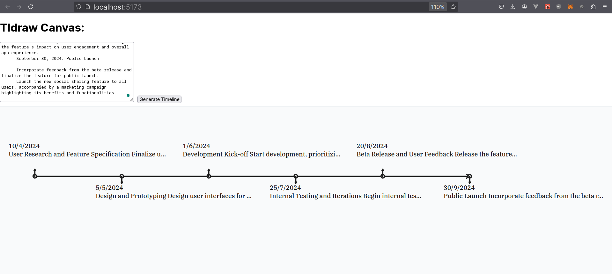
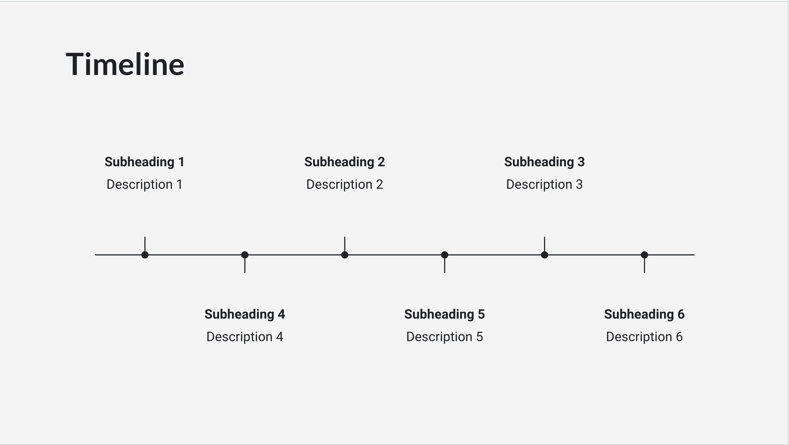

# Implementation Overview

## Sample Timeline Image



# Use this sample input

- Q2 2024
  April 10, 2024: User Research and Feature Specification

      Finalize user research highlighting the need for a social feature that allows users to share their health achievements with friends within the app.
      Complete detailed feature specifications, including privacy controls and user interaction models.
      May 5, 2024: Design and Prototyping

      Design user interfaces for the social sharing feature, focusing on ease of use and integration with existing app functionalities.
      Develop a clickable prototype for internal review and early feedback from select users.
      June 1, 2024: Development Kick-off

      Start development, prioritizing core functionalities such as posting updates, friend interactions, and privacy settings.
      Implement analytics to track user engagement and interaction with the new feature.
      Q3 2024
      July 25, 2024: Internal Testing and Iterations

      Begin internal testing to identify bugs and usability issues.
      Iterate on the feature based on feedback, refining the UI/UX and ensuring seamless integration with the app's existing features.
      August 20, 2024: Beta Release and User Feedback

      Release the feature to beta testers, a select group of existing users who have opted in for early access.
      Collect and analyze user feedback, focusing on the feature's impact on user engagement and overall app experience.
      September 30, 2024: Public Launch

      Incorporate feedback from the beta release and finalize the feature for public launch.
      Launch the new social sharing feature to all users, accompanied by a marketing campaign highlighting its benefits and functionalities.

## Imports and Setup:

- Import necessary React hooks and components from `@tldraw/tldraw`.
- Define the `TimelineEvent` interface to structure the timeline events.

## Component State:

- Use `useState` to manage `inputText` for the textarea and `editor` for the Tldraw editor instance.

## Handle Input Change:

- `handleInputChange` updates `inputText` state when the textarea content changes.

## Parse Input:

- `parseInput` function processes the input text to extract timeline events.
  - Splits input into lines, matches dates, and creates `TimelineEvent` objects.
  - Removes the year from the description and sorts events by date.

## Generate Timeline:

- `generateTimeline` function uses the Tldraw editor to create a visual timeline.
  - Clears existing shapes, parses input text, and creates shapes for the timeline.
  - Draws a horizontal line, dots for events, labels, and connecting lines.

## Render Component:

- Renders a textarea for input and a button to generate the timeline.
- Displays the Tldraw editor and sets the editor instance on mount.

# Alai Coding Challenge: TLDraw Timeline Implementation

Welcome to the Alai Coding Challenge! This project is set up with React, TypeScript, and TLDraw.

## Challenge Overview

Your task is to create a timeline component using TLDraw, similar to the one found on https://getalai.com/. You will also need to implement a user input feature to dynamically generate timeline elements.

## Tasks

1. Create a timeline element using TLDraw similar to what you can see on https://getalai.com/
   

2. Add an input field where the user can enter desired number of items and a generate button. When the user clicks generate,
   then the timeline element should show that many number of elements.

## Getting Started

1. Clone this repository
2. Install dependencies:
   ```
   npm install
   ```
3. Run the development server:
   ```
   npm run dev
   ```
4. Open your browser and navigate to `http://localhost:5173` (or the port shown in your terminal)

## Project Structure

- `src/App.tsx`: Main application component
- `src/TldrawComponent.tsx`: TLDraw canvas implementation (You'll likely need to modify this)

## Evaluation Criteria

- Feature completion: All required features are fully implemented and functional.
- Code quality and organization
- Proper use of React, TypeScript, and TLDraw

## Submission

Please create a private repo for your submission to avoid leaking the solution. Add our emails (krishna@getalai.com and anmol@getalai.com) when you're ready for review.
Include a brief description of your approach and any challenges you faced.

## Resources

- [TLDraw Documentation](https://tldraw.dev/)
- [React Documentation](https://reactjs.org/)
- [TypeScript Documentation](https://www.typescriptlang.org/docs/)

Good luck, and we look forward to seeing your implementation!
